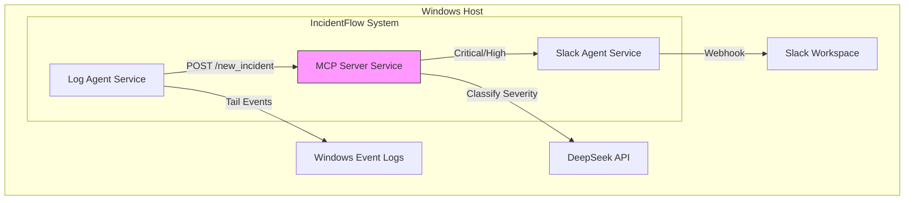
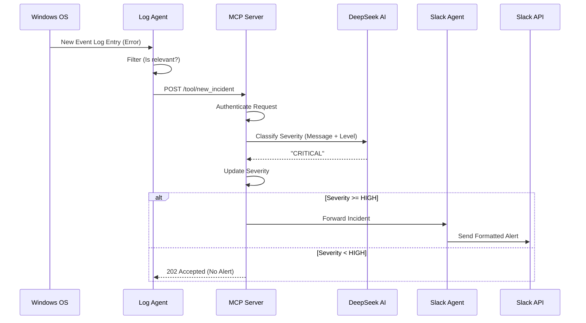

# System Architecture

## 📂 Project Structure

```bash
incidentflow/
├── agents/                 # Microservices (Agents)
│   ├── log_agent/          # Monitors Windows Event Logs
│   │   └── main.py
│   └── slack_agent/        # Handles Slack API communication
│       └── main.py
├── install/                # Installation & Setup Scripts
│   └── install_services.ps1
├── mcp_server/             # Core Logic (The "Brain")
│   ├── server.py           # FastAPI entry point
│   ├── security.py         # Authentication logic
│   └── severity_ai.py      # AI Severity Classification (DeepSeek)
├── shared/                 # Shared logic & schemas
│   └── incident_schema.py  # Pydantic models
├── website/                # Project Showcase / Landing Page
└── verify_flow.ps1         # Testing scripts
```

## 🧩 Component Diagram

The system consists of three decoupled Windows Services communicating via HTTP/REST.



## 🔄 Sequence Diagram (Incident Lifecycle)

How a single incident flows through the system:



## 🔐 Security Architecture

1.  **Service Isolation**: Each component runs as a separate Windows Service.
2.  **Internal Auth**: Services communicate using `X-API-Key` headers.
3.  **Local Processing**: Logs are filtered locally; only potential incidents are sent to the AI.
